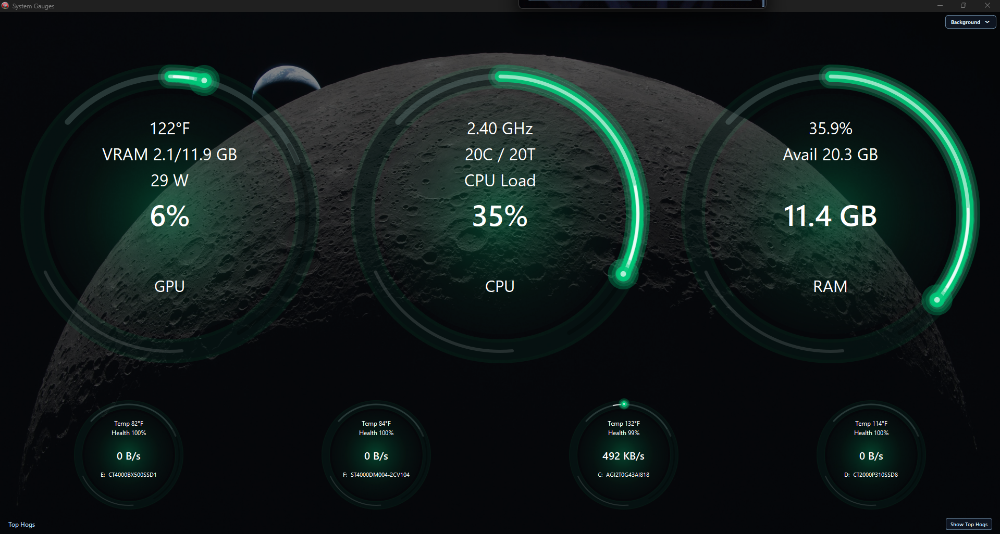
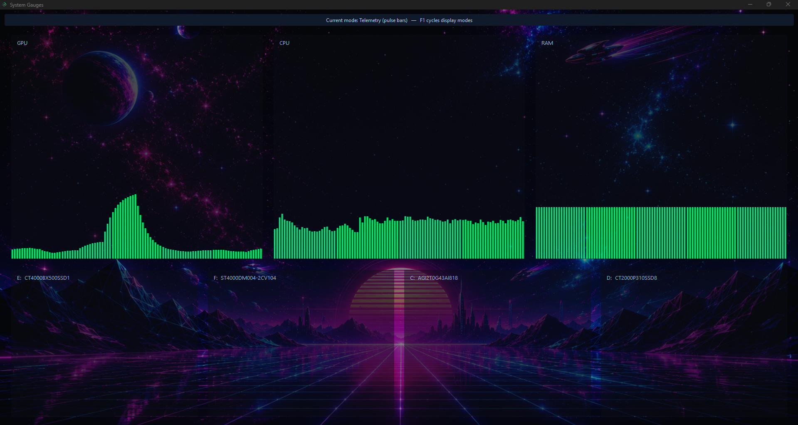
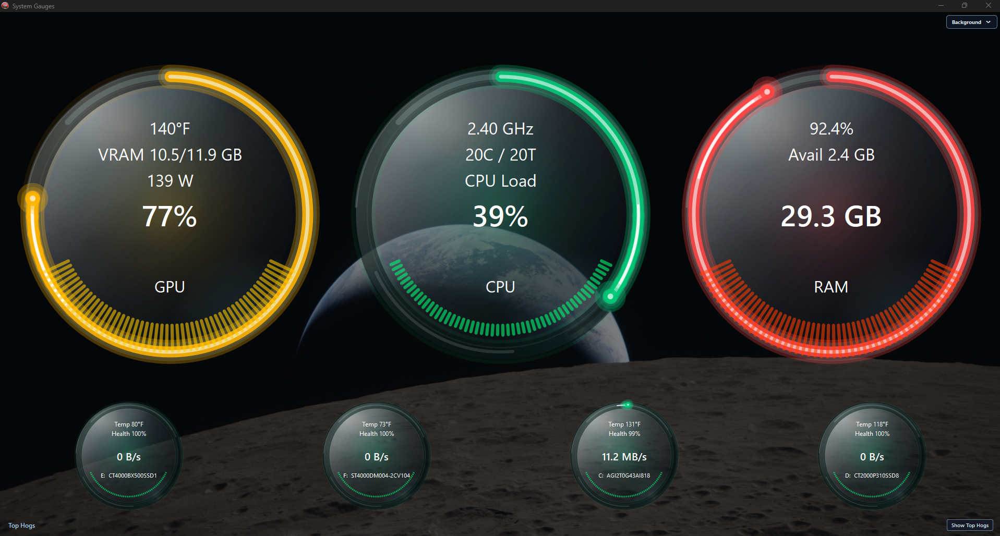
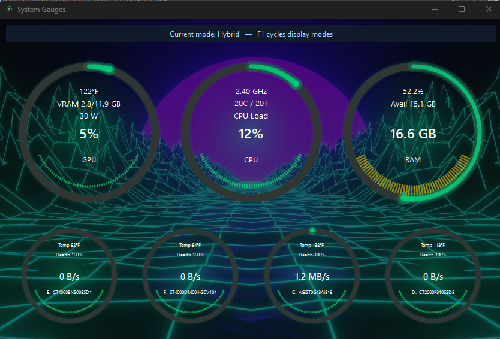
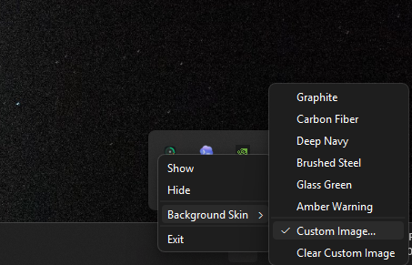

# System Gauges

System Gauges is a polished Windows desktop telemetry panel for CPU, GPU, RAM, and SMART-enabled storage. It uses animated circular gauges, adaptive sizing, and a compact `3 up top / 4 below` dashboard layout.



## Features

- CPU load, frequency, core/thread count, and usage gauge.
- NVIDIA GPU usage, temperature, VRAM, and power draw through NVML.
- RAM usage, available memory, and color-coded warning states.
- Drive activity, SMART temperature, and SMART health for SATA/SSD/NVMe drives.
- Smooth animated gauge rings with tracer effects.
- Resizable PyQt6 interface with system tray show/hide/exit actions.
- Static image backgrounds plus optional silent looping video backgrounds.
- Background SMART polling so slow disk queries do not freeze the UI.

## Requirements

- Windows 10 or newer.
- Python 3.11+.
- NVIDIA GPU and current NVIDIA drivers for GPU telemetry.
- [smartmontools](https://www.smartmontools.org/) installed at `C:\Program Files\smartmontools\bin\smartctl.exe`.

Install Python dependencies:

```powershell
pip install PyQt6 psutil WMI pywin32 nvidia-ml-py openrgb-python
```

`openrgb-python` is optional. If OpenRGB is not installed/running, the monitor still works; RGB sync is skipped.

## Usage

From the repository folder:

```powershell
python -m monitor
```

Run as Administrator if SMART temperature or health is missing for some drives. Some Windows storage devices expose partial SMART data without admin rights, but full logs may require elevation.

Keyboard:

- `F1`: cycle Classic, Telemetry, and Hybrid display modes.

Tray menu:

- `Background Skin`: choose a preset dashboard background skin. The selected skin is saved to `%APPDATA%\SystemGauges\config.json`.
- `Background Skin > Custom Image...`: choose a `.png`, `.jpg`, `.jpeg`, `.webp`, or `.bmp` image as the dashboard background. A dark overlay is applied automatically to preserve gauge readability.
- `Background Skin > Custom Video...`: choose a looping `.mp4`, `.mov`, `.m4v`, `.avi`, `.mkv`, `.webm`, or `.wmv` video background. Video playback is muted, painted behind the gauges, and dimmed so the dashboard remains readable.

Config background keys:

- `background_type`: `image` or `video`.
- `custom_image_path`: path to the static image fallback.
- `custom_video_path`: path to the optional animated video background.

If video playback is unavailable or fails, System Gauges falls back to the saved custom image when one exists, otherwise it returns to the default preset skin.

## Screenshots

Classic:


Telemetry:



Hybrid:



Video background hybrid:



Tray background menu:



## Notes

- GPU telemetry is NVIDIA-only.
- SMART data is refreshed less often than CPU/GPU/RAM to avoid excessive disk queries.
- Drive tiles intentionally show activity speed, temperature, and health only.
- The `nvidia-ml-py` package is imported as `pynvml`; this is expected.
- Custom image and video backgrounds use a fixed dark overlay in this build; opacity and blur controls are planned for a later pass.

## Build EXE

```powershell
python -m pip install pyinstaller
python -m PyInstaller --onefile --windowed --name SystemGauges --icon app.ico --add-data "app.ico;." monitor.py
```

The finished executable will be created at `dist\SystemGauges.exe`.

## Release

The repository includes a GitHub Actions workflow that builds `SystemGauges.exe` on Windows.

To publish a release:

```powershell
git tag v1.0.0
git push origin v1.0.0
```

GitHub will build the EXE and attach it to the release. The EXE is intentionally not committed directly to the repository.
